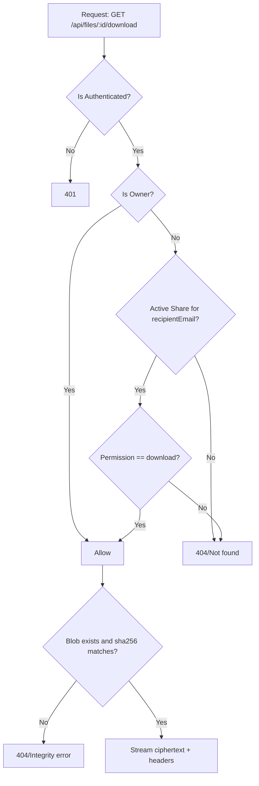
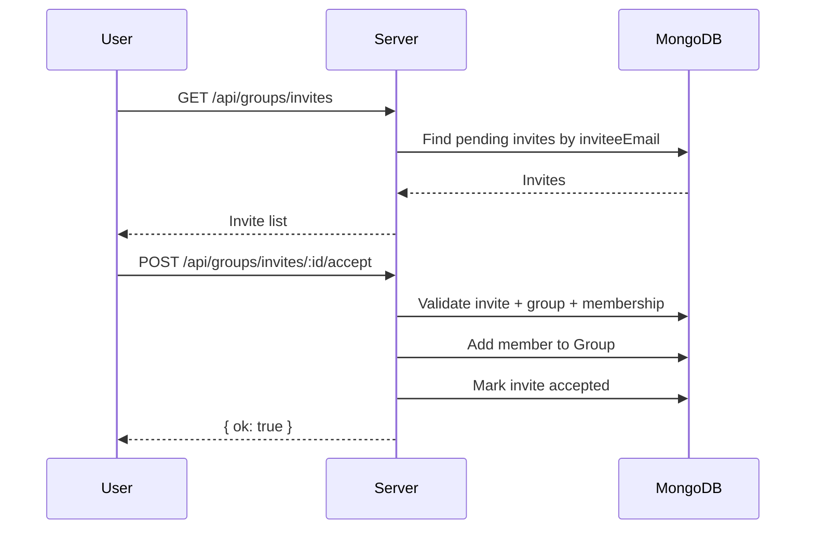

# Secure Sharing Platform — Software Design Document (SDD)

Date: 2026-01-27

## 1. Introduction

### 1.1 Purpose
This SDD describes **how** the Secure Sharing Platform is designed and implemented. It translates SRS requirements into architecture, components, data design, and interfaces.

### 1.2 System Goals
- Secure file sharing with client-side encryption.
- Strict access control for download operations.
- Reliable storage using a stable server storage directory.
- Clear UX for integrity failures (“bytes missing”).

## 2. High-Level Architecture (HLD)

### 2.1 Architecture Overview
- **Client UI:** legacy HTML/CSS/JS dashboards (duplicated: root and `client/public/legacy/`).
- **React/Vite wrapper:** routes/hosts legacy pages (iframe). Primary UI logic is still in legacy scripts.
- **API Server:** Node.js + Express (ES modules).
- **Authentication:** Firebase Authentication (client) + Firebase Admin SDK (server verification).
- **Database:** MongoDB (Mongoose schemas).
- **Storage:** Disk directory holding ciphertext blobs (configured via `STORAGE_DIR`).

### 2.2 Architecture Diagram
```mermaid
flowchart TB
  subgraph Client[Browser]
    UI[Legacy UI صفحات
(HTML/CSS/JS)]
    Crypto[Web Crypto API
AES-GCM + SHA-256]
  end

  subgraph Server[Node/Express API]
    Auth[Auth Middleware
requireAuth/requireAdmin]
    Files[Files Router
/api/files]
    Groups[Groups Router
/api/groups]
    AdminR[Admin Router
/api/admin]
    Metrics[Metrics Middleware]
  end

  subgraph Data[Data Layer]
    DB[(MongoDB)]
    FS[(Disk Storage
STORAGE_DIR)]
  end

  UI --> Crypto
  UI -->|HTTPS + Bearer Token| Auth
  Auth --> Files
  Auth --> Groups
  Auth --> AdminR

  Files --> DB
  Files --> FS
  Groups --> DB
  AdminR --> DB
  Metrics --> AdminR
```

## 3. Key Design Decisions

### 3.1 Encryption Model
- Primary mode is **client-side encryption**.
- Browser encrypts plaintext to ciphertext using **AES-GCM** before upload.
- Server stores ciphertext as-is and keeps metadata needed for decryption (e.g., IV).
- Encryption key is shared out-of-band; the platform does not store plaintext keys.

### 3.2 Integrity Model
- Server stores `storedSha256Hex` for ciphertext bytes.
- The API computes `integrityOk` by hashing stored bytes and comparing to `storedSha256Hex`.
- When integrity fails (missing/corrupt blob), UI disables actions and shows a clear error.

### 3.3 Storage Directory Stability
- File blobs live under a configured directory (`STORAGE_DIR`).
- Path resolution prefers a record’s `storagePath` if it exists, otherwise uses `storageKey` under `STORAGE_DIR`.

## 4. Component Design

### 4.1 Server Components

#### 4.1.1 Authentication (`server/src/auth.js`)
- `requireAuth()` validates Bearer token.
- In production, verifies Firebase token and enforces email verification.
- In dev (if Firebase Admin creds are absent), can decode JWT payload without verification to enable local development.

#### 4.1.2 Files & Shares (`server/src/routes.files.js`)
Responsibilities:
- Upload handling (multer, memory storage).
- Writes ciphertext bytes to storage.
- Stores `FileRecord` metadata.
- Share creation and listing (direct + group).
- Download access control: owner OR active share with download permission.
- Deletion semantics:
  - owner delete soft-hides if shared (`ownerDeletedAt`)
  - final cleanup when last share removed.

Key helpers:
- `resolveStoragePath(record)`
- `computeIntegrityOk(record)`
- `computeConfidentialityOk(record)`

#### 4.1.3 Groups (`server/src/routes.groups.js`)
Responsibilities:
- Group CRUD (create/list)
- Membership and role checks (`owner/admin/editor/member/viewer`)
- Invite workflow (pending → accepted/declined)
- Policy fields: default permission, security level, data residency rule, expiry.

#### 4.1.4 Admin (`server/src/routes.admin.js`)
Responsibilities:
- Admin access check (`/api/admin/access`)
- Overview aggregation (`/api/admin/overview`) including traffic metrics
- Read-only listing endpoints for users/files/shares

#### 4.1.5 Metrics (`server/src/metrics.js`)
- Captures traffic counters and exposes snapshot.

### 4.2 Client Components

#### 4.2.1 Legacy UI (root and `client/public/legacy/`)
Responsibilities:
- Handles login state and navigation.
- Encrypts/decrypts file bytes via Web Crypto.
- Calls API endpoints for list/upload/share/download/delete.
- Shows custom recipient email suggestions (per-account recent emails).
- Shows Profile → “Storage details” fullscreen popup.

## 5. Data Design (MongoDB)

### 5.1 Collections

#### 5.1.1 FileRecord
Key fields:
- ownerUid, encryptionMode
- originalName, mimeType, size
- storagePath, storageKey
- clientIvB64 (for client encryption)
- storedSha256Hex, originalSha256Hex (optional)
- ownerDeletedAt (soft delete for owner)

#### 5.1.2 ShareRecord
Key fields:
- fileId, ownerUid
- recipientEmail, senderEmail, createdByUid
- permission (download/view_only)
- sourceType (direct/group), groupId
- revokedAt, expiresAt

Uniqueness:
- `(fileId, recipientEmail)` unique.

#### 5.1.3 Group
Key fields:
- name, ownerUid
- policy fields: defaultPermission, policySecurityLevel, dataResidencyRule
- expiresAt, isDisabled
- members array (uid/email/role)

#### 5.1.4 GroupInvite
- groupId/groupName
- inviter email/uid
- inviteeEmail, role, status

#### 5.1.5 AuditLog
- actor, action, target, meta, timestamps

## 6. API Design (Selected)

### 6.1 Identity
- `GET /api/me` → `{ uid, email }`

### 6.2 Files
- `GET /api/files` → list owned files with `integrityOk` / `confidentialityOk`
- `POST /api/files` → upload ciphertext
- `GET /api/files/:id/download` → returns ciphertext stream + headers:
  - `X-Enc-Mode`, `X-Client-Iv-B64`, `X-Original-Name`, `X-Original-Mime`, `X-Stored-Sha256`, `X-Original-Sha256`
- `DELETE /api/files/:id` → owner delete semantics

### 6.3 Shares
- `POST /api/files/:id/share` → validate recipient (Firebase Admin)
- `GET /api/files/shared/with-me`
- `GET /api/files/shared/by-me`
- `DELETE /api/files/shares/:shareId` → revoke or remove; may trigger cleanup

### 6.4 Groups
- `GET /api/groups`
- `POST /api/groups` (create)
- `GET /api/groups/invites`
- `POST /api/groups/invites/:inviteId/accept|decline`

### 6.5 Admin
- `GET /api/admin/access`
- `GET /api/admin/overview`

## 7. Error Handling Strategy
- API returns JSON errors with `error` and sometimes `hint`.
- UI displays server-provided messages for download failures.
- Files with `integrityOk === false` are treated as non-downloadable.

## 8. Requirements Traceability (Design ↔ Requirements)
See docs/SRS.md RTM table for requirement → component mapping.

## 9. Diagrams (Mermaid)

### 9.1 Access Control Decision (Download)


### 9.2 Group Invite Flow

