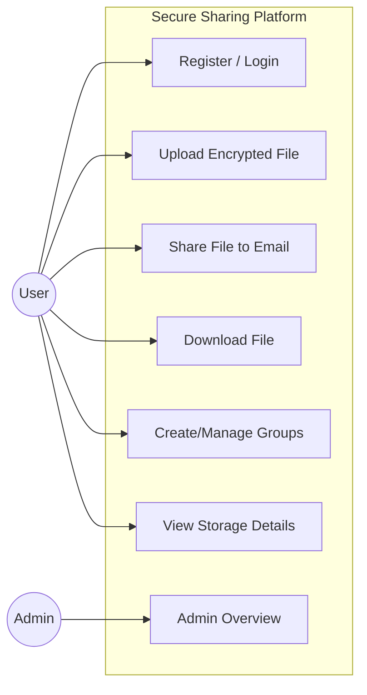
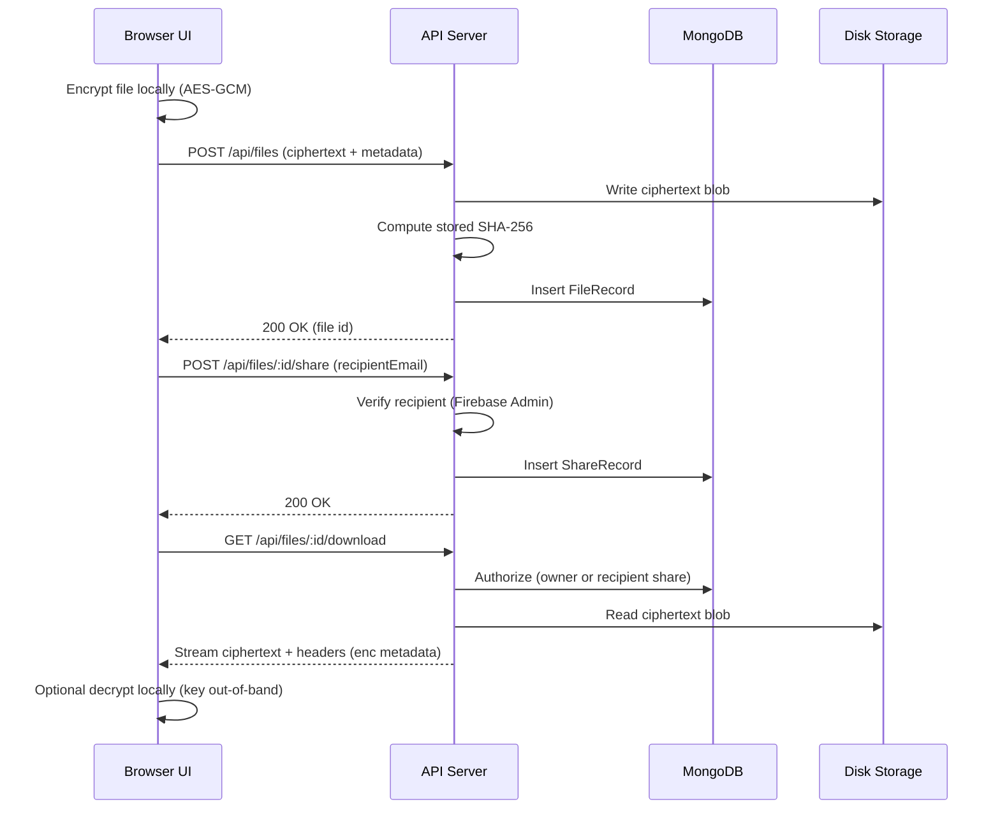

# Secure Sharing Platform — Software Requirements Specification (SRS)

Date: 2026-01-27

## 1. Introduction

### 1.1 Purpose
This SRS defines the functional and non-functional requirements for the **Secure Sharing Platform**. It is intended to be used by stakeholders, developers, testers, and maintainers to ensure the system is implemented and verified consistently.

### 1.2 Scope
**In scope**
- User authentication via Firebase Authentication (email/password) with verified email enforcement.
- Upload of files where **encryption occurs client-side** (browser) using AES-GCM; server stores ciphertext.
- File listing, download, optional client-side decryption.
- Sharing to recipients via email and to groups (role/permission based).
- Group membership via Add member (pending acceptance; backend uses invite/accept).
- Admin read-only visibility and metrics; RBAC enforcement for admin endpoints.
- Integrity and confidentiality flags, including “missing bytes” handling.
- UI: legacy static pages (root) and legacy pages hosted under `client/public/legacy/` (React wrapper uses iframe).

**Out of scope (unless explicitly added later)**
- End-to-end key escrow/recovery (platform does not store plaintext keys).
- Virus/malware scanning of uploaded content.
- Enterprise compliance features beyond basic audit logging.

### 1.3 Definitions & Acronyms
- **AES-GCM:** Authenticated encryption mode used for confidentiality + integrity at the crypto layer.
- **Ciphertext:** Encrypted file bytes stored on server disk.
- **Firebase ID Token:** JWT used to authorize API calls.
- **NFR:** Non-functional requirement.
- **RBAC:** Role-based access control.
- **RTM:** Requirements Traceability Matrix.
- **SRS / SDD / SDLC:** Standard software documentation artifacts.

## 2. Overall Description

### 2.1 Product Perspective
The system is a client-server web application:
- Browser UI encrypts files before upload.
- API server stores ciphertext on disk and metadata in MongoDB.
- Access to download is granted only to the owner or valid recipients.

### 2.2 Product Functions (High-Level)
- Register/Login/Logout (Firebase auth)
- Upload encrypted file (client-side encryption mode)
- List owned files
- Share file to recipient email (validated user + verified email) and/or to groups
- List files shared “with me” and “by me”
- Download ciphertext (and optionally decrypt in browser)
- Delete file (owner) and delete/revoke shares
- Groups: create, list, invite, accept/decline invites, manage members by role
- Admin: overview metrics, list users/files/shares
- Profile: show “Storage details” for the logged-in account

### 2.3 User Classes and Characteristics
- **Standard User:** upload, share, download, manage groups, view storage details.
- **Recipient User:** receives shares, downloads permitted files.
- **Group Owner/Admin:** manages group members and sharing policies.
- **System Admin:** accesses admin endpoints and dashboards.

### 2.4 Assumptions and Dependencies
- Firebase Authentication is available and configured.
- MongoDB is reachable and writable.
- Server storage directory is persistent and configured (recommended: `STORAGE_DIR`).
- Users share encryption keys out-of-band (the platform does not store keys).

## 3. External Interface Requirements

### 3.1 User Interface (UI)
- Pages include login, register, home dashboard (uploads/chats/groups), admin dashboard, forgot-password, logout.
- UI must provide clear error messages for failed downloads (e.g., stored bytes missing).

### 3.2 Software Interfaces (APIs)
All `/api/*` endpoints require:
- `Authorization: Bearer <Firebase ID Token>`
- Verified email (in production mode)

Key endpoints (representative):
- `GET /health`, `GET /api/me`
- Files: `GET /api/files`, `POST /api/files`, `GET /api/files/:id/download`, `DELETE /api/files/:id`
- Shares: `POST /api/files/:id/share`, `GET /api/files/shared/with-me`, `GET /api/files/shared/by-me`, `DELETE /api/files/shares/:shareId`
- Groups: `GET /api/groups`, group invites, membership management
- Admin: `GET /api/admin/access`, `GET /api/admin/overview`, list endpoints

### 3.3 Communication Interfaces
- HTTPS recommended for production.
- CORS policy restricts allowed origins (dev allows localhost/LAN patterns).

## 4. System Features and Functional Requirements

### 4.1 Authentication & Identity
- **FR-AUTH-01:** The system shall authenticate API requests using a Firebase ID token provided as a Bearer token.
- **FR-AUTH-02:** The system shall reject API requests without a valid Bearer token with HTTP 401.
- **FR-AUTH-03:** The system shall reject requests from unverified emails with HTTP 403 in production verification mode.
- **FR-AUTH-04:** The system shall provide an identity endpoint that returns the authenticated user’s UID and email.

### 4.2 File Upload & Storage
- **FR-FILE-01:** The system shall allow an authenticated user to upload a file as ciphertext (client-side encrypted) using multipart upload.
- **FR-FILE-02:** The system shall store uploaded ciphertext bytes on disk in a server-controlled storage directory.
- **FR-FILE-03:** The system shall store file metadata in MongoDB including owner UID, original name, mime type, size, and storage path reference.
- **FR-FILE-04:** The system shall compute and store a SHA-256 hash of stored ciphertext bytes for integrity verification.

### 4.3 File Listing
- **FR-LIST-01:** The system shall list a user’s active (non-owner-deleted) files sorted by creation time.
- **FR-LIST-02:** The system shall include integrity and confidentiality flags for each file record.

### 4.4 Sharing (Direct)
- **FR-SHARE-01:** The system shall allow a file owner to share a file to a recipient email.
- **FR-SHARE-02:** The system shall validate that the recipient email corresponds to an existing verified Firebase user (when Firebase Admin is configured).
- **FR-SHARE-03:** The system shall prevent duplicate shares of the same file to the same email.
- **FR-SHARE-04:** The system shall support permission levels at least including `download` and `view_only`.

### 4.5 Sharing (Groups)
- **FR-GRP-01:** The system shall allow authenticated users to create and list groups they belong to.
- **FR-GRP-02:** The system shall manage group membership via invitation workflow (pending → accepted/declined).
- **FR-GRP-03:** The system shall enforce group roles (owner/admin/editor/member/viewer) for group operations.

### 4.6 Download & Access Control
- **FR-DL-01:** The system shall allow file download only if the requester is the file owner or has an active share permitting download.
- **FR-DL-02:** The system shall return appropriate encryption metadata in response headers for client-mode files (e.g., client IV).
- **FR-DL-03:** If stored bytes are missing or fail integrity validation, the system shall return an error response that clearly indicates the issue.

### 4.7 Deletion
- **FR-DEL-01:** The system shall allow an owner to delete a file.
- **FR-DEL-02:** If a file has active shares, deleting by owner shall hide it for the owner but keep it available for recipients until shares are removed.
- **FR-DEL-03:** The system shall allow recipients to delete received shares.
- **FR-DEL-04:** If the owner deleted the file and the last recipient deletes the share, the system shall clean up stored bytes and metadata.

### 4.8 Admin Features
- **FR-ADM-01:** The system shall provide an endpoint to check if the current user has admin privileges.
- **FR-ADM-02:** The system shall restrict admin endpoints to admins only.
- **FR-ADM-03:** The system shall provide an overview endpoint with aggregated counts (users/files/shares) and traffic metrics.

### 4.9 Audit Logging
- **FR-AUD-01:** The system shall record audit logs for security-relevant actions (e.g., group invite accept/decline, sharing actions) on a best-effort basis.

### 4.10 Profile “Storage Details” (UI)
- **FR-UI-01:** The UI shall display “Storage details” for the logged-in account including total file count and total bytes across files.
- **FR-UI-02:** The UI shall display “emails contacted” based on recipient history scoped to the logged-in account.

## 5. Non-Functional Requirements (NFR)

### 5.1 Security
- **NFR-SEC-01:** All `/api/*` endpoints shall require authentication.
- **NFR-SEC-02:** Authorization shall be enforced server-side for download and share operations.
- **NFR-SEC-03:** Ciphertext bytes shall be stored at rest on the server; plaintext shall not be stored.
- **NFR-SEC-04:** The system shall not store client-side plaintext encryption keys.

### 5.2 Reliability & Integrity
- **NFR-REL-01:** The system shall detect missing or corrupted stored ciphertext via SHA-256 verification.
- **NFR-REL-02:** The UI shall not repeatedly attempt download/decrypt/share for records flagged as missing bytes (`integrityOk === false`).

### 5.3 Performance
- **NFR-PERF-01:** Under normal load, 95% of metadata requests (list files, list shares) shall complete within 2 seconds.

### 5.4 Usability
- **NFR-USE-01:** Error messages shown in the UI shall include actionable hints when available.
- **NFR-USE-02:** Disabled states for actions shall be visually distinct but readable.

### 5.5 Maintainability
- **NFR-MTN-01:** The system shall centralize configuration via environment variables and `server/src/config.js`.
- **NFR-MTN-02:** Storage directory resolution shall be consistent across routes.

## 6. Requirements Traceability Matrix (RTM)

| Requirement ID | Description | Primary Components | Verification Method |
|---|---|---|---|
| FR-AUTH-01 | API auth via Firebase ID token | Server: `requireAuth()` | API tests / manual calls |
| FR-FILE-01 | Upload ciphertext bytes | `POST /api/files` | Upload test + DB record |
| FR-FILE-04 | Store SHA-256 of stored bytes | `storedSha256Hex`, integrity check | Upload then verify integrityOk |
| FR-DL-01 | Owner/recipient-only download | `GET /api/files/:id/download`, `canAccessFile()` | Access control tests |
| FR-DL-03 | Missing bytes yields clear error | download route + UI error display | Delete blob then download |
| FR-DEL-04 | Cleanup on last share removal | `DELETE /api/files/shares/:shareId` cleanup | Scenario test |
| FR-GRP-02 | Invite accept/decline | `/api/groups/invites/*` | API tests |
| FR-ADM-03 | Admin overview metrics | `GET /api/admin/overview` | API tests |
| FR-UI-01 | Storage details popup | UI + `GET /api/files` | UI verification |

## 7. Appendix — Diagrams (Mermaid)

### 7.1 Use Case Diagram (High Level)

### 7.2 Upload + Share + Download Flow

